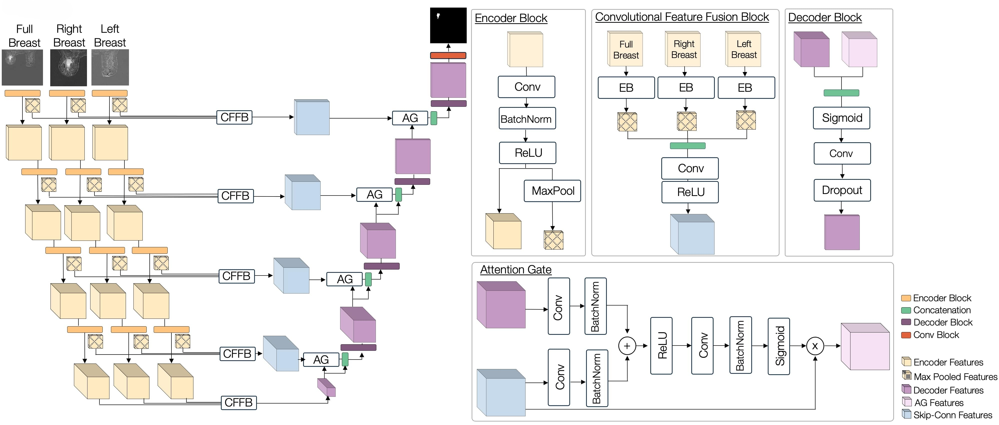

# VENUS: Breast Segmentation Framework

## Introduction

This repository implements VENUS, a multiscale attention-based deep learning method for DCE-MRI breast tumor segmentation. It include training and inference pipelines for baseline models and the proposed VENUS model on both a proprietary dataset and the public BreaDM dataset. For methodological details, see our ICIP 2025 paper: https://ieeexplore.ieee.org/document/11084484.




## Data Preparation

### Datasets

- Primary (proprietary) dataset: 103 patients, each with one pre-contrast and three post-contrast 3D T1 DCE-MRI volumes. Acquired on 1.5T Siemens and 3T GE scanners, totaling ~76.8k 2D breast slices (∼19.2k per sequence type). Each slice is annotated with semi-automatic segmentations of mass (circumscribed) and non-mass (infiltrating and diffusing) tumors. Annotations were mostly performed by a radiologist with six years of mammographic experience, with the remainder by two radiology residents (one and two years of experience). This dataset is not publicly shareable; the protocol was approved by the Ethics Committee of Sapienza University of Rome.
- Public dataset (BreaDM): 232 patients, each with one pre-contrast and eight post-contrast volumes, with manually annotated mass breast cancer segmentations by experienced radiologists. The dataset comprises ~29.2k 2D slices (∼3.2k per sequence type) from a single 3T scanner. Reference: https://www.sciencedirect.com/science/article/pii/S0010482523007205

### Data Preprocessing

The preprocessing pipeline is implemented in [`breast_segmentation/transforms/`](breast_segmentation/transforms/) and orchestrated by the `Preprocess` class. It is used for both the public BreaDM and the private datasets and is fully parameterized via [`breast_segmentation/config/settings.py`](breast_segmentation/config/settings.py).

What it does (high level):
- Focuses the field-of-view on breast tissue by removing irrelevant regions (thorax/top and bottom), trimming black borders, and cropping to the informative area.
- Standardizes appearance via smoothing, histogram normalization, and intensity normalization.
- Optionally prepares breast patches automatically for models that operate on patches (used by the VENUS pipeline), while preserving whole-image processing for baselines.

How it works (key steps):
- Loading and formatting: grayscale conversion, channel-first, metadata tracking.
- Denoise and normalize: median smoothing and histogram normalization; dataset-aware intensity normalization using subtrahend/divisor (mean/std) and, when available, precomputed “subtracted” images.
- Region cleanup: remove thorax (top) and bottom using thresholds/margins; trim lateral black regions based on intensity sums; crop to a tight square and pad if needed.
- Breast localization: adaptive breast cropping (left/right halves) and dimension/variance filters to discard unusable samples.
- Resizing: preliminary resizing to target size (e.g., 512×512) and final resizing for training/inference (e.g., 256×256).
- Patch extraction: when `get_patches=True`, `BoundingBoxSplit` generates positive/negative breast patches; `PrepareSample` reconstructs the processed region and aligns metadata. Baselines use whole images (`get_patches=False`).
- Boundary supervision (optional): when `get_boundaryloss=True`, distance-transform maps are computed for boundary-aware losses.

Modes and configuration:
- Modes: `train`, `test`, and `statistics` select the appropriate sub-pipeline (e.g., statistics disables augmentation).
- Dataset-aware behavior: parameters (e.g., thresholds, margins, histogram bins) differ for BreaDM vs. private datasets and are selected internally.
- Main params in [`breast_segmentation/config/settings.py`](breast_segmentation/config/settings.py): histogram bins, thorax/bottom thresholds and margins, black-threshold/tolerance for trimming, target sizes, bounding-box size, pad size, and normalization constants.

### Structure of Data Folder

```
venus/                               # Project root
├── breast_segmentation/             # Backend functions & architectures (including VENUS)
├── run-scripts/                     # Command-line training and testing scripts
│   ├── train/                       # Training scripts
│   │   ├── train_baselines_breadm.py
│   │   ├── train_baselines_private.py
│   │   ├── train_venus_breadm.py
│   │   └── train_venus_private.py
│   └── test/                        # Inference/testing scripts
│       ├── inference_dataset_aware_breadm.py
│       └── inference_dataset_aware_private.py
├── run-notebooks/                   # Jupyter notebook counterparts
│   ├── train/                       # Training notebooks
│   └── test/                        # Testing notebooks
├── checkpoints/                     # Model checkpoints
│   ├── breadm-dataset/
│   └── private-dataset/
├── download/                        # Dataset download utilities
├── BreaDM/                          # BreaDM dataset (gitignored)
│   └── seg/                         # Segmentation data
└── Dataset-arrays-4-FINAL/         # Private dataset (gitignored)
```

## Implementation

### Hardware Prerequisites

Training, validation, and testing were run on an NVIDIA A40 (48 GB). Smaller GPUs are suitable for training and appropriate for inference; we also validated runs on a GeForce RTX 3060.

### Dependencies

- Python 3.8+
- CUDA-compatible GPU recommended
- Install dependencies using Poetry:

```bash
git clone https://github.com/pablogiaccaglia/venus
cd venus
poetry install
poetry shell
```

### Configuration

All model parameters, hyperparameters, dataset paths, and training configurations are specified in [`breast_segmentation/config/settings.py`](breast_segmentation/config/settings.py). Modify this file to adjust:

- Dataset paths
- Model architectures
- Training hyperparameters
- Preprocessing parameters
- Checkpoint directories

### Training

#### Command Line Scripts

Train baseline models on BreaDM dataset:
```bash
poetry run python run-scripts/train/train_baselines_breadm.py
```

Train baseline models on private dataset:
```bash
poetry run python run-scripts/train/train_baselines_private.py
```

Train VENUS model on BreaDM dataset:
```bash
poetry run python run-scripts/train/train_venus_breadm.py
```

Train VENUS model on private dataset:
```bash
poetry run python run-scripts/train/train_venus_private.py
```

#### Jupyter Notebooks

For detailed pipeline visualization and step-by-step execution, use the corresponding notebooks in [`run-notebooks/train/`](run-notebooks/train/):

- [`run-notebooks/train/training_baselines_breastdm.ipynb`](run-notebooks/train/training_baselines_breastdm.ipynb)
- [`run-notebooks/train/training_baselines_private.ipynb`](run-notebooks/train/training_baselines_private.ipynb)
- [`run-notebooks/train/training_venus_breastdm.ipynb`](run-notebooks/train/training_venus_breastdm.ipynb)
- [`run-notebooks/train/training_venus_private.ipynb`](run-notebooks/train/training_venus_private.ipynb)

### Testing

#### Command Line Scripts

Run inference on BreaDM dataset:
```bash
poetry run python run-scripts/test/inference_dataset_aware_breadm.py
```

Run inference on private dataset:
```bash
poetry run python run-scripts/test/inference_dataset_aware_private.py
```

#### Jupyter Notebooks

For detailed inference analysis, use the corresponding notebooks in [`run-notebooks/test/`](run-notebooks/test/):

- [`run-notebooks/test/inference_dataset_aware_breastdm.ipynb`](run-notebooks/test/inference_dataset_aware_breastdm.ipynb)
- [`run-notebooks/test/inference_dataset_aware_private.ipynb`](run-notebooks/test/inference_dataset_aware_private.ipynb)

### Model Weights

Model weights are available in the [`checkpoints/`](checkpoints/) directory:

- [`checkpoints/breadm-dataset/`](checkpoints/breadm-dataset/)
- [`checkpoints/private-dataset/`](checkpoints/private-dataset/)

## Citation

If you find this repository useful, please cite our paper:

```
@INPROCEEDINGS{11084484,
  author={Giaccaglia, Pablo and Poles, Isabella and Lidoni, Valentina and Rizzo, Veronica and Gentili, Michele and Pediconi, Federica and Santambrogio, Marco D. and D’Arnese, Eleonora},
  booktitle={2025 IEEE International Conference on Image Processing (ICIP)}, 
  title={A Multiscale Attention-Based Deep Learning Method for DCE-MRI Breast Tumor Segmentation}, 
  year={2025},
  pages={1906-1911},
  keywords={Deep learning;Image segmentation;Accuracy;Breast tumors;Semantics;Venus;Morphology;Breast cancer;Decoding;Image reconstruction;Breast Cancer;DCE-MRI;Deep Learning;Image segmentation},
  doi={10.1109/ICIP55913.2025.11084484}}
```

## Acknowledgments
We acknowledge the authors of the BreaDM dataset used in this study ([BreaDM dataset](https://www.sciencedirect.com/science/article/pii/S0010482523007205)).

## Contact

Pablo Giaccaglia (pablo.giaccaglia@polimi.it),
Isabella Poles (isabella.poles@polimi.it)
